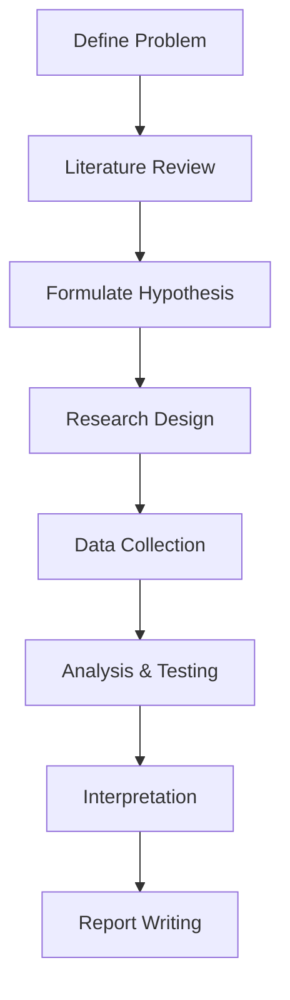

# Unit 1: Introduction to Research (PYQ Solutions)

> [!NOTE]
> This unit covers the definition, objectives, and process of research. It is the foundation for all other units. Expect questions on Qualitative vs. Quantitative and the Research Process.

---

## 1. Describe the Research Process with a suitable diagram.
**[APR-2025 | JAN-2026 | 10 Marks]**

The research process consists of a series of actions or steps necessary to effectively carry out research.

### Steps in Research Process:
1. **Defining the Research Problem:** Identifying the specific issue or question to be investigated.
2. **Reviewing the Literature:** Studying existing research to understand what is already known.
3. **Formulating Hypothesis:** Making a tentative assumption to test the research problem.
4. **Preparing Research Design:** Creating a blueprint for data collection and analysis.
5. **Data Collection:** Gathering information using methods like surveys, interviews, or observations.
6. **Data Analysis:** Processing and interpreting the collected data using statistical tools.
7. **Hypothesis Testing:** Determining if the data supports or rejects the hypothesis.
8. **Generalization and Interpretation:** Drawing conclusions from the findings.
9. **Reporting:** Writing the final research report or thesis.

### Diagram

---

## 2. Compare Qualitative and Quantitative Research with suitable examples.
**[APR-2025 | JAN-2026 | 5-10 Marks]**

| Basis | Qualitative Research | Quantitative Research |
| :--- | :--- | :--- |
| **Goal** | To understand underlying reasons/motives. | To quantify data and generalize results. |
| **Data** | Non-numerical (Text, Video, Audio). | Numerical (Statistics, Percentages). |
| **Approach** | Subjective / Inductive. | Objective / Deductive. |
| **Sample Size** | Small, non-representative. | Large, representative. |
| **Method** | Interviews, Case Studies, Focus Groups. | Surveys, Experiments, Polls. |
| **Example** | Understanding *why* students skip lectures. | Measuring *how many* students skip lectures. |

---

## 3. What is Research Methodology? Explain its significance.
**[APR-2025 | JAN-2026 | 5 Marks]**

### Definition
Research Methodology is a way to systematically solve the research problem. it is a science of studying how research is done scientifically.

### Significance:
* **Systematic Approach:** Provides a logical sequence for conducting research.
* **Validity:** Ensures that the results obtained are valid and reliable.
* **Objectivity:** Helps the researcher remain unbiased during the study.
* **Efficiency:** Saves time and resources by providing a clear path.
* **Academic/Professional Growth:** Essential for masters/doctoral students to contribute to the field of knowledge.

---

## 4. Explain the Importance of Literature Review in Research.
**[APR-2025 | 5 Marks]**

1. **Identifies Research Gap:** Helps find what has NOT been studied yet.
2. **Prevents Duplication:** Ensures you are not repeating work already done.
3. **Provides Context:** Helps understand the background and history of the topic.
4. **Refines Methodology:** Learn from the successes and failures of previous researchers' methods.
5. **Supports Findings:** Provides a basis for comparing your results with existing knowledge.

---

> [!TIP]
> **Exam Hack:** For the "Research Process" question, always draw the flowchart (Mermaid diagram above). It fetches full marks for clarity.
