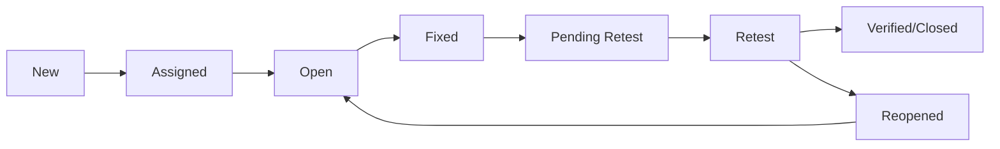

# Unit 5: Automation & Defect Management (PYQ Solutions)

> [!NOTE]
> This unit covers the modern aspects of testing: Automation tools (Selenium, Postman, JIRA) and the Defect Life Cycle. A diagram of the Defect Life Cycle is almost certain to be asked.

---

## 1. What is CAST? Explain its benefits.
**[APR-2025 | 5 Marks]**

CAST stands for **Computer-Aided Software Testing**. It refers to the use of software tools to assist in various testing activities.

### Benefits:
* **Speed:** Automation tools can execute tests much faster than humans.
* **Repeatability:** Tests can be run exactly the same way multiple times.
* **Reliability:** Eliminates human error (fatigue, oversight).
* **Coverage:** Can run thousands of complex test cases that are impossible manually.
* **Cost-Effective:** Long-term reduction in testing costs for regression suites.

---

## 2. Narrate the stages of Defect Life Cycle.
**[APR-2025 | JAN-2026 | 5-10 Marks]**

The Defect Life Cycle (Bug Life Cycle) is the specific journey of a defect from its discovery to its closure.

### Stages:
1. **New:** When a defect is logged for the first time.
2. **Assigned:** Developer is assigned to fix it.
3. **Open:** Developer starts analyzing and fixing the bug.
4. **Fixed:** Developer has fixed the code and verified it.
5. **Pending Retest:** Waiting for the tester to verify the fix.
6. **Retest:** Tester verifies the fix in the new environment.
7. **Verified/Closed:** Tester confirms the fix is working.
8. **Reopened:** If the fix fails during retest.
9. **Deferred:** Fix is postponed to future releases.
10. **Rejected:** Not a valid bug (e.g., duplicate or "works as designed").

### Diagram

---

## 3. Explain the components of Selenium.
**[JAN-2026 | 5 Marks]**

Selenium is a suite of tools for automating web browsers.

1. **Selenium IDE:** A browser plugin for record-and-playback.
2. **Selenium WebDriver:** A programming interface to create and execute test cases. It interacts directly with the browser.
3. **Selenium Grid:** Used for parallel testing across different browsers and operating systems.
4. **TestNG:** A testing framework (often used with Selenium) that provides features like annotations, grouping, and reporting.

---

## 4. What are the steps to introduce a Testing Tool?
**[APR-2025 | JAN-2026 | 5 Marks]**

1. **Requirement Analysis:** Identify the need for automation.
2. **Tool Evaluation:** Compare available tools (Open source vs. Paid).
3. **Proof of Concept (PoC):** Run a small pilot project to check feasibility.
4. **Staff Training:** Train the team on the selected tool.
5. **Implementation:** Start using the tool in actual projects.
6. **Maintenance & Review:** Regularly update scripts and review the tool's ROI.

---

> [!TIP]
> **Exam Hack:** For the "Defect Life Cycle" diagram, make sure to show the "Reopened" and "Deferred" states clearly. They are the most important transitions.
